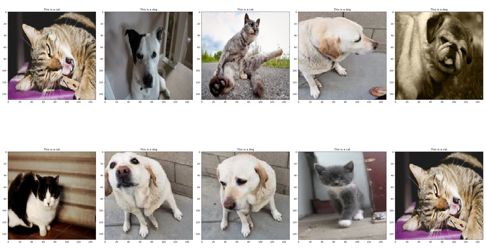

# CatsAndDogs

## Question 1:

For debugging purposes, you can lower the number of training and validation samples
by a factor of say 20, and run for 1 epoch (Note: if you make the number of training samples
too small, it triggers some internal error in Keras). What accuracy do you obtain, and why?

Epoch 1/1

1/93 [..............................] - ETA: 4:09 - loss: 0.7171 - acc: 0.5625
 
2/93 [..............................] - ETA: 3:35 - loss: 0.6821 - acc: 0.5938

.

.

.

92/93 [============================>.] - ETA: 2s - loss: 0.4853 - acc: 0.7520

93/93 [==============================] - 317s 3s/step - loss: 0.4832 - acc: 0.7540 - val_loss: 0.3010 - val_acc: 0.8717

We get an accuracy of 0.8717 for validation set. This is pretty good for a small dataset. 
The reason we get a good result is because we are using transfer learning which means we are taking 
advantage of a pre-trained model that has been trained on a very large dataset. The intuition is that
this model has already learnt basic shape and structures of animals so we only need to train higher level 
features. 

## Question 2: 

If you fine-tune for 1 or 2 epochs using the original number of training and validation
samples, what accuracy do you obtain, and why? Does your saved model now work better
with your testing utility

Epoch 1/1

1/1875 [..............................] - ETA: 1:26:06 - loss: 0.7838 - acc: 0.4375

2/1875 [..............................] - ETA: 1:15:23 - loss: 0.7769 - acc: 0.4375

.

.

.

1874/1875 [============================>.] - ETA: 2s - loss: 0.2418 - acc: 0.8957

1875/1875 [==============================] - 4101s 2s/step - loss: 0.2417 - acc: 0.8957 - val_loss: 0.1872 - val_acc: 0.9185

We get an accuracy of 0.9185! The reason we get better accuracy is because the more data we have per epoch the easier it
is to update the weights. This is generally true, the more data the better the model. Both models did really well on 
my testing utility (perfect predictions). This maybe because we used a small sample size of 10 images per class.

## Classification Testing Utility

Here is the results from classification testing utility

The cute labrador is mine! I took pictures from different angles to see if that would make a difference but it didn't!